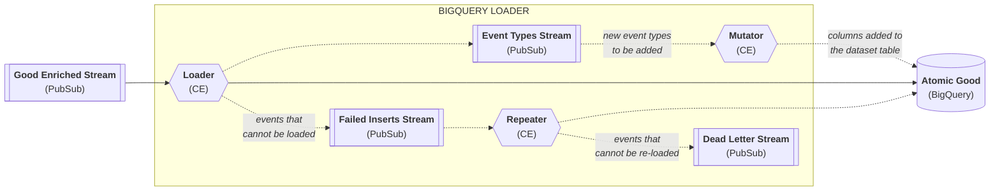

```mdx-code-block
import Tabs from '@theme/Tabs';
import TabItem from '@theme/TabItem';
```

**Let’s take a look at what's deployed on GCP upon running the quick start example script.**

Note: you can very easily edit the script by removing certain modules, giving you the flexibility to design the topology of your pipeline according to your needs.

<!-- see https://github.com/facebook/docusaurus/issues/8357 -->
<Tabs groupId="destination" lazy>
  <TabItem value="postgres" label="Postgres" default>

```mermaid
%%{init: {"flowchart": {"curve": "bump"}}}%%
flowchart LR
    trackers>Trackers]
    subgraph "SNOWPLOW PIPELINE IN YOUR CLOUD ACCOUNT"
        collect{{"<b>Collector</b>\n<i>stream-collector app</i>\n(CE)"}}
        raw[["<b>Raw Stream</b>\n(PubSub)"]]
        enrich{{"<b>Enrich</b>\n<i>enrich-pubsub app</i>\n(CE)"}}
        iglu{{"<b>Iglu Server</b>\n(CE)"}}
        igludb[("<b>Iglu Database</b>\n(CloudSQL)")]
        good[["<b>Good Enriched Stream</b>\n(PubSub)"]]
        bad[["<b>Bad Stream</b>\n(PubSub)"]]
        loadergood{{"<b>Postgres Loader Good</b>\n(CE)"}}
        loaderbad{{"<b>Postgres Loader Bad</b>\n(CE)"}}
        subgraph "&nbsp;&nbsp;<b>Postgres</b> (CloudSQL)&nbsp;&nbsp;"
            psgood[("Atomic Good")]
            psbad[("Atomic Bad")]
        end
        enrich-.-oiglu<-.->igludb
        collect~~~iglu %% an invisible link to align the pipeline better
        collect-->raw-->enrich-->good-->loadergood-->psgood
        collect & enrich -."<i>events that\nfail validation</i>".->bad-.->loaderbad-.->psbad
    end
    trackers-->collect
```

  </TabItem>
  <TabItem value="bigquery" label="BigQuery">


```mermaid
%%{init: {"flowchart": {"curve": "bump"}}}%%
flowchart LR
    trackers>Trackers]
    subgraph "SNOWPLOW PIPELINE IN YOUR CLOUD ACCOUNT"
        collect{{"<b>Collector</b>\n<i>stream-collector app</i>\n(CE)"}}
        raw[["<b>Raw Stream</b>\n(PubSub)"]]
        enrich{{"<b>Enrich</b>\n<i>enrich-pubsub app</i>\n(CE)"}}
        iglu{{"<b>Iglu Server</b>\n(CE)"}}
        igludb[("<b>Iglu Database</b>\n(CloudSQL)")]
        good[["<b>Good Enriched Stream</b>\n(PubSub)"]]
        bad[["<b>Bad Stream</b>\n(PubSub)"]]
        bqgood[("<b>Atomic Good</b>\n(BigQuery)")]
        subgraph bq["BIGQUERY LOADER"]
            loader("<i>detailed below</i>")
            style loader fill:none,stroke:none
        end
        enrich--oiglu<-->igludb
        collect~~~iglu %% an invisible link to align the pipeline better
        collect-->raw-->enrich-->good-->bq-->bqgood
        collect & enrich -."<i>events that\nfail validation</i>".->bad
    end
    trackers-->collect
```

***



  </TabItem>
</Tabs>

## Collector load balancer

This is an application load balancer for your inbound HTTP/S traffic. Traffic is routed from the load balancer to the collector.

For further details on the resources, default and required input variables, and outputs see the [terraform-google-lb](https://registry.terraform.io/modules/snowplow-devops/lb/google/latest) terraform module.

## Stream Collector

This is a Snowplow event collector that receives raw Snowplow events over HTTP, serializes them to a [Thrift](http://thrift.apache.org/) record format, and then writes them to pubsub. More details can be found [here](/docs/pipeline-components-and-applications/stream-collector/index.md).

For further details on the resources, default and required input variables, and outputs see the [collector-pubsub-ce](https://registry.terraform.io/modules/snowplow-devops/collector-pubsub-ce/google/latest) terraform module.

## Stream Enrich

This is a Snowplow app written in scala which:

- Reads raw Snowplow events off a Pubsub topic populated by the Scala Stream Collector
- Validates each raw event
- Enriches each event (e.g. infers the location of the user from his/her IP address)
- Writes the enriched Snowplow event to the enriched topic

It is designed to be used downstream of the [Scala Stream Collector](/docs/pipeline-components-and-applications/stream-collector/index.md). More details can be found [here](/docs/pipeline-components-and-applications/enrichment-components/stream-enrich/index.md).

For further details on the resources, default and required input variables, and outputs see the [enrich-pubsub-ce](https://registry.terraform.io/modules/snowplow-devops/enrich-pubsub-ce/google/latest) terraform module.

## Pubsub topics

Your pubsub topics are a key component of ensuring a non-lossy pipeline, providing crucial back-up, as well as serving as a mechanism to drive real time use cases from the enriched stream.

For further details on the resources, default and required input variables, and outputs see the [pubsub-topic](https://registry.terraform.io/modules/snowplow-devops/pubsub-topic/google/latest) terraform module.

### Raw stream

Collector payloads are written to this raw pubsub topic, before being picked up by the Enrich application.

### Enriched topic

Events that have been validated and enriched by the Enrich application are written to this enriched stream.

### Bad 1 topic

This bad topic is for events that the collector or enrich fail to process. An event can fail at the collector point due to, for instance, it being too large for the stream creating a size violation bad row, or it can fail during enrichment due to a schema violation or enrichment failure. More details can be found [here](/docs/managing-data-quality/failed-events/understanding-failed-events/index.md).

<Tabs groupId="destination">
  <TabItem value="postgres" label="Postgres" default>

No other pubsub topics.

  </TabItem>
  <TabItem value="bigquery" label="BigQuery">

### Bad Rows topic

This bad topic contains events that could not be inserted into BigQuery by the loader.  This includes data is not valid against its schema or is somehow corrupted in a way that the loader cannot handle.

## BigQuery datasets

There will be one new dataset available with the suffix `_snowplow_db`.  Within which there will be a table called `events` - all of your collected events will be available here generally within a few seconds after they are sent into the pipeline.

## GCS buckets

For any data that cannot be loaded at all we have deployed a dead letter bucket which will have the suffix `-bq-loader-dead-letter`.  All events that are re-tried by the `repeater` and fail to be inserted into BigQuery end up here.

  </TabItem>
</Tabs>

## Iglu

[Iglu](/docs/pipeline-components-and-applications/iglu/index.md) allows you to publish, test and serve schemas via an easy-to-use RESTful interface. It is split into a few services.

### Iglu load balancer

This load balances the inbound traffic and routes traffic to the Iglu Server.

For further details on the resources, default and required input variables, and outputs see the [google-lb](https://registry.terraform.io/modules/snowplow-devops/collector-pubsub-ce/google/latest) terraform module.

### Iglu Server

The [Iglu Server](https://github.com/snowplow-incubator/iglu-server/) serves requests for Iglu schemas stored in your schema registry. 

For further details on the resources, default and required input variables, and outputs see the [iglu-server-ce](https://registry.terraform.io/modules/snowplow-devops/iglu-server-ce/google/latest) terraform module.

### Iglu CloudSQL

This is the Iglu Server database where the Iglu schemas themselves are stored.

For further details on the resources, default and required input variables, and outputs see the [cloud-sql](https://registry.terraform.io/modules/snowplow-devops/cloud-sql/google/latest) terraform module.

<Tabs groupId="destination">
  <TabItem value="postgres" label="Postgres" default>

## Postgres loader

The Snowplow application responsible for reading the enriched and bad data and [loading to Postgres](/docs/pipeline-components-and-applications/loaders-storage-targets/snowplow-postgres-loader/index.md).

For further details on the resources, default and required input variables, and outputs see the [postgres-loader-pubsub-ce](https://registry.terraform.io/modules/snowplow-devops/postgres-loader-pubsub-ce/google/latest) terraform module.

  </TabItem>
  <TabItem value="bigquery" label="BigQuery">

## BigQuery loader

The Snowplow application responsible for reading the enriched data and [loading to BigQuery](/docs/pipeline-components-and-applications/loaders-storage-targets/bigquery-loader/index.md).

For further details on the resources, default and required input variables, and outputs see the [bigquery-loader-pubsub-ce](https://registry.terraform.io/modules/snowplow-devops/bigquery-loader-pubsub-ce/google/latest) terraform module.

  </TabItem>
</Tabs>

Next, start [tracking events from your own application](/docs/getting-started-on-snowplow-open-source/tracking-events/index.md).
